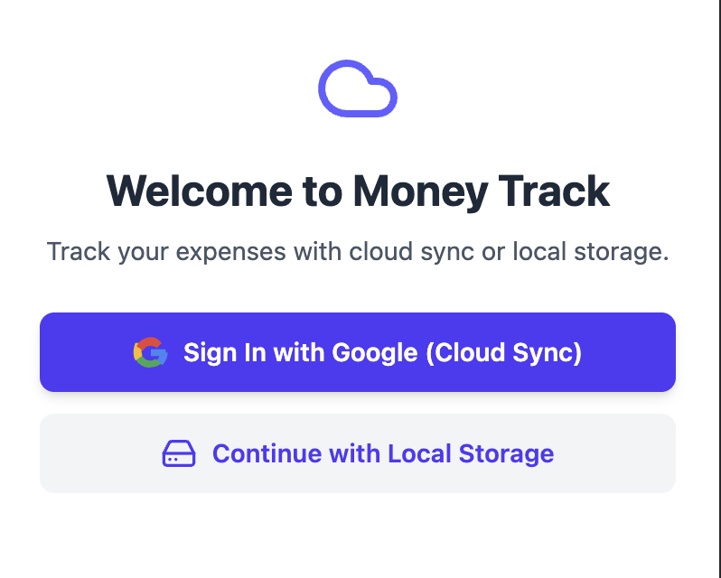
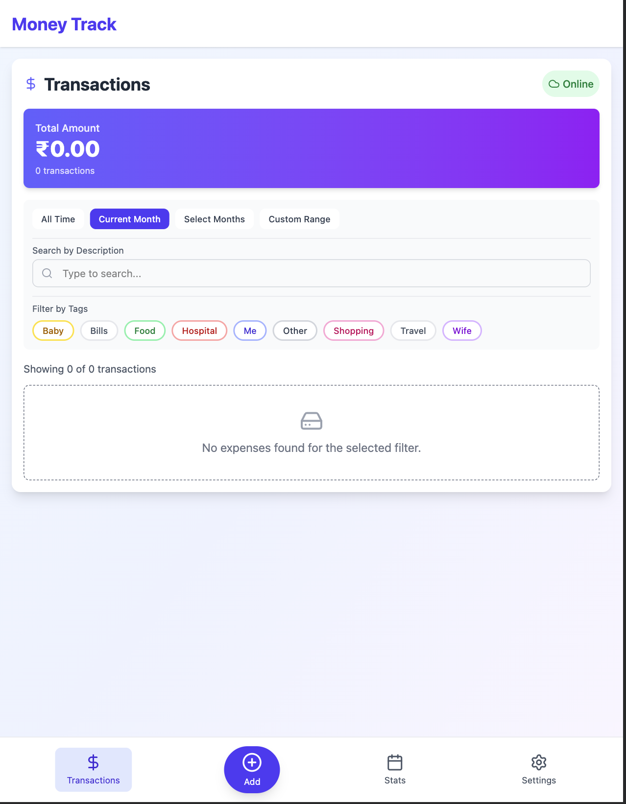
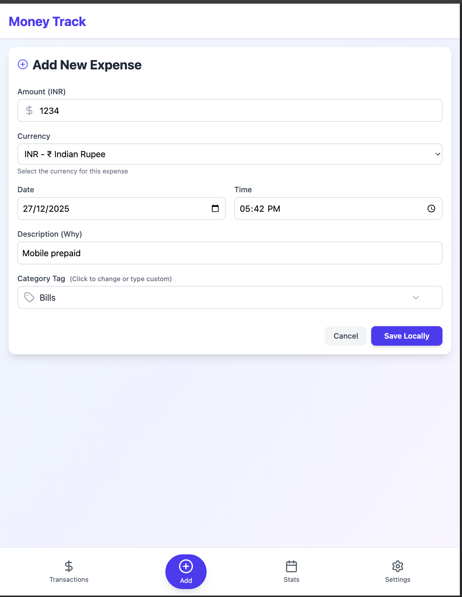
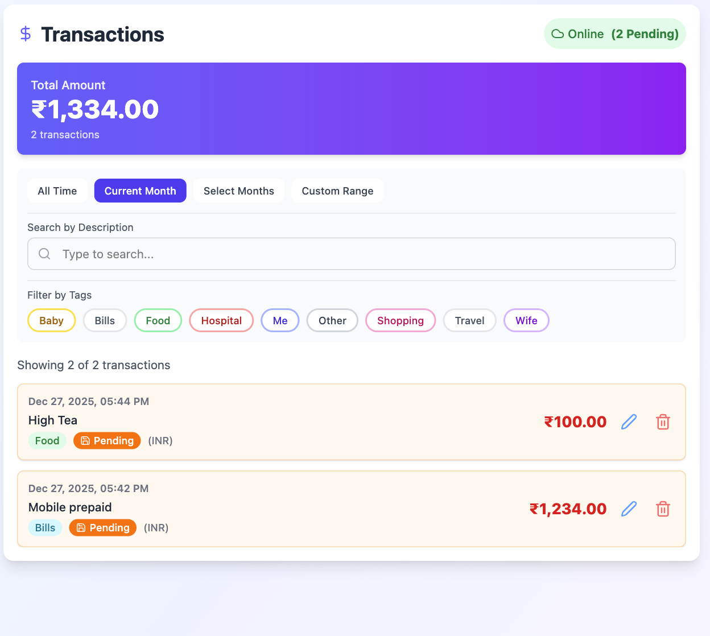
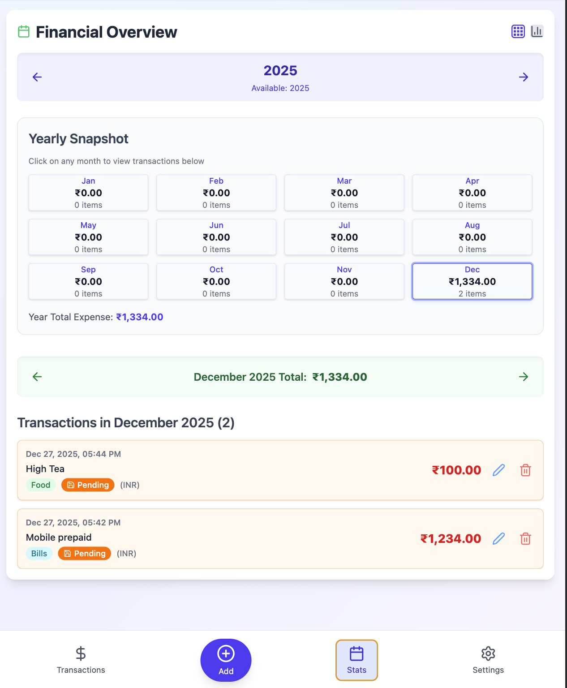
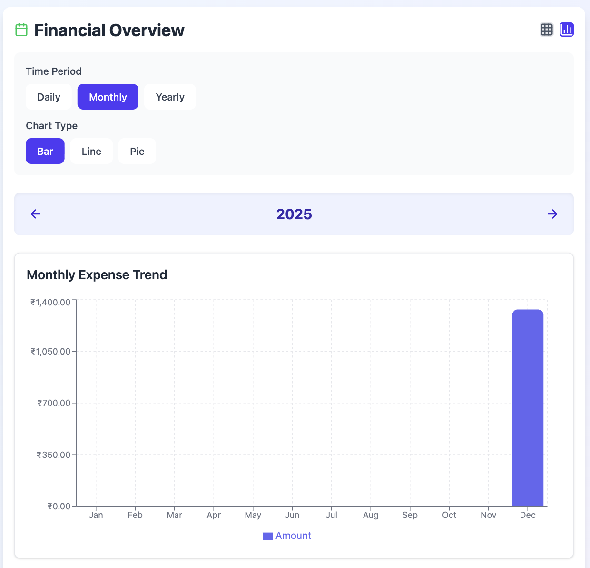
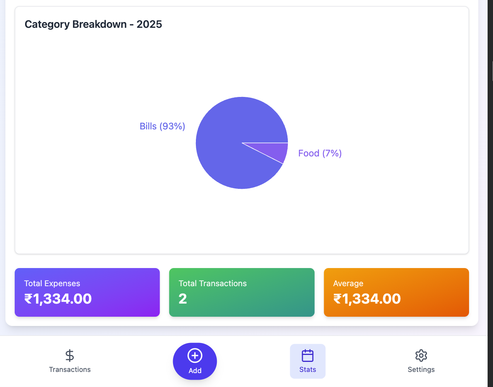
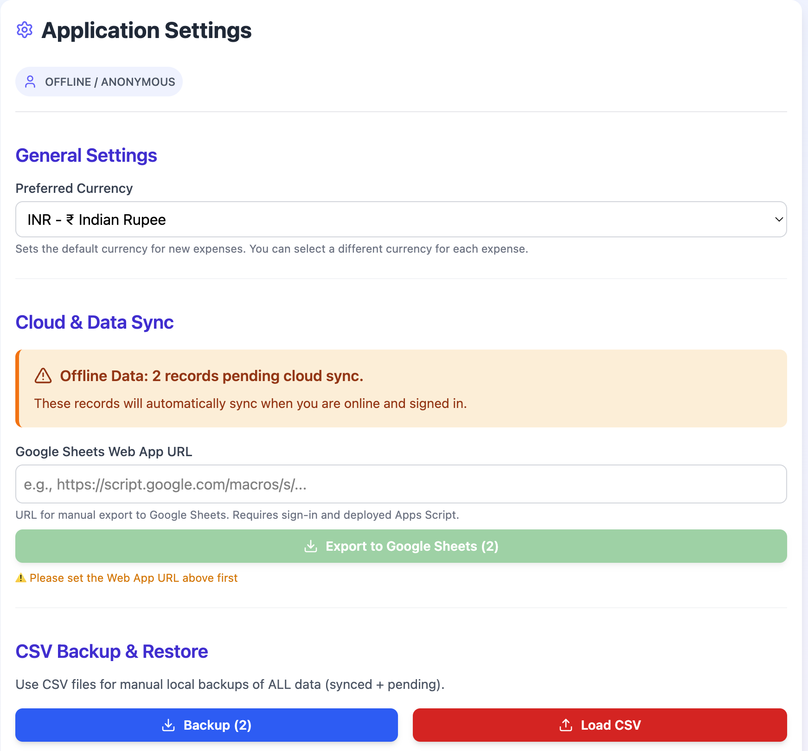

# ExpenseManager

A modern, feature-rich expense tracking Progressive Web App built with React, TypeScript, and Vite. Track your expenses seamlessly across devices with optional cloud sync, multi-currency support, and powerful analytics.



## ✨ Features

### 🚀 Core Capabilities
- **🔓 No sign-in required**: Start tracking immediately — all data stored locally in your browser
- **☁️ Optional cloud sync**: Sign in with Google for Firebase backup and multi-device synchronization
- **💱 Multi-currency support**: Track expenses in 15+ currencies (INR, USD, EUR, GBP, JPY, and more)
- **📊 Live exchange rates**: Real-time currency conversion powered by ExchangeRate-API
- **📱 Progressive Web App**: Install on any device for a native app experience
- **🔌 Full offline support**: Work seamlessly offline with automatic sync when reconnected
- **📈 Advanced analytics**: Interactive trend charts with daily, weekly, and monthly views
- **📤 Multiple export options**: Export to CSV or Google Sheets
- **🏷️ Smart categorization**: Predefined tags for quick expense organization

### 💰 Multi-Currency Features
- Support for 15 popular currencies with proper symbols and formatting
- Live exchange rate conversion for accurate cross-currency totals
- Per-expense currency selection
- Statistics view with currency conversion toggle
- Automatic rate updates when online

### 📊 Statistics & Analytics
- **Yearly overview**: Grid view of all 12 months with total spending per month
- **Monthly details**: Detailed expense list for selected month
- **Trend charts**: Interactive visualizations with:
  - Time period selection (7 days, 30 days, 90 days, 1 year, all time)
  - Chart type toggle (bar chart, line chart, area chart)
  - Daily, weekly, and monthly aggregation views
  - Hover tooltips with detailed breakdowns
- **Currency conversion**: View statistics in any supported currency with live rates

### 🎨 Modern UI/UX
- Clean, responsive design that works on all devices
- Smooth animations and transitions
- Tag-based color coding for visual expense categorization
- Online/offline status indicator
- Pending sync status badges
- Dark mode support (system preference)

## 📸 Screenshots

### Home Page


### Add Expense


### Expenses List


### Statistics Overview


### Trend Charts


### Advanced Analytics


### Settings


## 🎯 Usage Modes

| Feature | Local-Only Mode | Cloud Sync Mode |
|---------|----------------|-----------------|
| Add/view/edit/delete expenses | ✅ | ✅ |
| Multi-currency support | ✅ | ✅ |
| Live exchange rates | ✅ | ✅ |
| Statistics & trend charts | ✅ | ✅ |
| CSV export/import | ✅ | ✅ |
| Google Sheets export | ✅ | ✅ |
| PWA installation | ✅ | ✅ |
| Multi-device access | ❌ | ✅ |
| Cloud backup | ❌ | ✅ |
| Google sign-in | ❌ | ✅ |
| Setup required | ❌ | ✅ (Firebase config) |

## 🚀 Quick Start

### 1. Clone and Install

```bash
cd ExpenseManager/expense-manager
npm install
```

### 2. Configure Environment (Optional for Cloud Sync)

Create a `.env.local` file from the template:

```bash
cp .env.example .env.local
```

Edit `.env.local` with your Firebase credentials:

```env
VITE_FIREBASE_API_KEY=your_api_key
VITE_FIREBASE_AUTH_DOMAIN=your_auth_domain
VITE_FIREBASE_DATABASE_URL=your_database_url
VITE_FIREBASE_PROJECT_ID=your_project_id
VITE_FIREBASE_STORAGE_BUCKET=your_storage_bucket
VITE_FIREBASE_MESSAGING_SENDER_ID=your_messaging_sender_id
VITE_FIREBASE_APP_ID=your_app_id
```

> **Note**: The app works perfectly without Firebase configuration in local-only mode!

### 3. Run Development Server

```bash
npm run dev
```

Open the printed URL (usually `http://localhost:5173`) in your browser.

### 4. Build for Production

```bash
npm run build
npm run preview
```

## 🔧 Firebase Setup (Optional)

To enable cloud sync and multi-device access:

1. Create a [Firebase project](https://console.firebase.google.com/)
2. Enable **Realtime Database** with these security rules:

```json
{
  "rules": {
    "users": {
      "$uid": {
        ".read": "$uid === auth.uid",
        ".write": "$uid === auth.uid"
      }
    }
  }
}
```

3. Enable **Authentication** with the **Google** provider
4. Copy your Firebase config from **Project Settings > General**
5. Add the values to `.env.local`

Data is stored under `users/{uid}/expenses` in the Realtime Database.

## 📦 Supported Currencies

The app supports 15 popular currencies with live exchange rates:

- 🇮🇳 INR (Indian Rupee)
- 🇺🇸 USD (US Dollar)
- 🇪🇺 EUR (Euro)
- 🇬🇧 GBP (British Pound)
- 🇯🇵 JPY (Japanese Yen)
- 🇨🇳 CNY (Chinese Yuan)
- 🇦🇺 AUD (Australian Dollar)
- 🇨🇦 CAD (Canadian Dollar)
- 🇨🇭 CHF (Swiss Franc)
- 🇸🇬 SGD (Singapore Dollar)
- 🇦🇪 AED (UAE Dirham)
- 🇸🇦 SAR (Saudi Riyal)
- 🇰🇷 KRW (South Korean Won)
- 🇧🇷 BRL (Brazilian Real)
- 🇲🇽 MXN (Mexican Peso)

Exchange rates are fetched from [ExchangeRate-API](https://www.exchangerate-api.com/) and cached for 24 hours.

## 🏷️ Expense Categories

Predefined tags for quick categorization:

- 🛍️ Shopping
- 🍔 Food
- ✈️ Travel
- 🏥 Hospital
- 💝 Wife
- 👶 Baby
- 👤 Me
- 📄 Bills
- 📌 Other

Each tag has a unique color for easy visual identification.

## 📤 Export Options

### CSV Export
- Export all expenses to CSV format
- Import CSV files to restore or migrate data
- Format: `id,userId,amount,currency,description,tag,timestamp,dateStr,timeStr,syncStatus`

### Google Sheets Export
- One-click export to Google Sheets
- Automatic formatting with headers
- Opens in a new tab for immediate editing

## 🌐 Deployment

### GitHub Pages with GitHub Actions

Create `.github/workflows/deploy.yml`:

```yaml
name: Deploy to GitHub Pages

on:
  push:
    branches: [main]

jobs:
  build-and-deploy:
    runs-on: ubuntu-latest
    steps:
      - uses: actions/checkout@v3

      - name: Set up Node.js
        uses: actions/setup-node@v3
        with:
          node-version: '18'

      - name: Install dependencies
        run: cd ExpenseManager/expense-manager && npm install

      - name: Build app
        run: cd ExpenseManager/expense-manager && npm run build
        env:
          VITE_FIREBASE_API_KEY: ${{ secrets.FIREBASE_API_KEY }}
          VITE_FIREBASE_AUTH_DOMAIN: ${{ secrets.FIREBASE_AUTH_DOMAIN }}
          VITE_FIREBASE_DATABASE_URL: ${{ secrets.FIREBASE_DATABASE_URL }}
          VITE_FIREBASE_PROJECT_ID: ${{ secrets.FIREBASE_PROJECT_ID }}
          VITE_FIREBASE_STORAGE_BUCKET: ${{ secrets.FIREBASE_STORAGE_BUCKET }}
          VITE_FIREBASE_MESSAGING_SENDER_ID: ${{ secrets.FIREBASE_MESSAGING_SENDER_ID }}
          VITE_FIREBASE_APP_ID: ${{ secrets.FIREBASE_APP_ID }}

      - name: Deploy to GitHub Pages
        uses: peaceiris/actions-gh-pages@v3
        with:
          github_token: ${{ secrets.GITHUB_TOKEN }}
          publish_dir: ExpenseManager/expense-manager/dist
```

**Add GitHub Secrets**: Go to **Settings > Secrets and variables > Actions** and add all `FIREBASE_*` variables.

### Manual Deployment with gh-pages

```bash
npm run build
npx gh-pages -d dist --remote origin
```

Configure GitHub Pages to serve from the `gh-pages` branch.

## 🗂️ Project Structure

```
expense-manager/
├── src/
│   ├── App.tsx                 # Main application component
│   ├── components/             # Reusable components
│   │   ├── charts/            # Chart components (trend visualization)
│   │   ├── common/            # Common UI components
│   │   ├── layout/            # Layout components
│   │   └── PWAInstallPrompt.tsx
│   ├── views/                 # Main view components
│   │   ├── AddExpenseView/    # Add/edit expense form
│   │   ├── AuthView/          # Authentication view
│   │   ├── ListView/          # Expense list view
│   │   ├── SettingsView/      # Settings and data management
│   │   └── StatsView/         # Statistics and analytics
│   ├── services/              # Business logic and API services
│   │   ├── currencyService.ts # Exchange rate fetching
│   │   ├── expenseService.ts  # Expense CRUD operations
│   │   ├── firebaseService.ts # Firebase integration
│   │   └── storageService.ts  # LocalStorage management
│   ├── hooks/                 # Custom React hooks
│   ├── utils/                 # Utility functions
│   ├── constants/             # App constants (currencies, tags, etc.)
│   ├── types/                 # TypeScript type definitions
│   └── assets/                # Images and static assets
├── public/                    # Static files
└── dist/                      # Production build output
```

## 💾 Data Model

### Expense Object

```typescript
interface Expense {
  id: string;              // Unique identifier
  userId: string;          // User ID (for cloud sync)
  amount: number;          // Expense amount
  currency: string;        // Currency code (e.g., 'USD', 'INR')
  description: string;     // Expense description
  tag: string;            // Category tag
  timestamp: number;       // Unix timestamp
  dateStr: string;        // Formatted date (YYYY-MM-DD)
  timeStr: string;        // Formatted time (HH:MM)
  syncStatus: 'synced' | 'pending';  // Cloud sync status
}
```

### Storage

- **LocalStorage key**: `moneytrack_local_expenses`
- **Firebase path**: `users/{uid}/expenses/{expenseId}`
- **Exchange rates cache**: `expense_exchange_rates` (24-hour TTL)

## 🔄 Offline Sync Behavior

1. **Offline mode**: All operations work normally, expenses marked as `pending`
2. **Coming online**: Automatic sync of pending expenses to Firebase
3. **Conflict resolution**: Local changes take precedence
4. **Status indicator**: Visual feedback for online/offline state

## 🛠️ Tech Stack

- **Frontend**: React 18 + TypeScript
- **Build tool**: Vite
- **Styling**: Tailwind CSS
- **Charts**: Recharts
- **Backend**: Firebase Realtime Database
- **Auth**: Firebase Authentication (Google)
- **PWA**: Vite PWA Plugin
- **Icons**: Lucide React
- **Currency API**: ExchangeRate-API

## 🤝 Contributing

1. Fork the repository
2. Create a feature branch: `git checkout -b feature/amazing-feature`
3. Make your changes and test locally with `npm run dev`
4. Commit your changes: `git commit -m 'Add amazing feature'`
5. Push to the branch: `git push origin feature/amazing-feature`
6. Open a Pull Request

## 📝 License

This project is open source and available for personal use.

## 🙏 Acknowledgments

- Exchange rates provided by [ExchangeRate-API](https://www.exchangerate-api.com/)
- Icons by [Lucide](https://lucide.dev/)
- Charts powered by [Recharts](https://recharts.org/)

---

**Made with ❤️ for better expense tracking**
